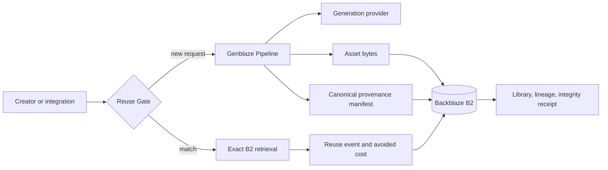

# Recall

**Generate once. Reuse forever.** Recall is a provenance-first memory layer for generative media. It preserves every generated asset, its Genblaze recipe, lineage, integrity hash, reuse history, and cost record in Backblaze B2 so teams can retrieve the original instead of paying to re-create it.

## Live demo

- Workspace: `/app`
- Health: `/api/health`
- Readiness: `/api/ready`
- OpenAPI: `/openapi.json`

The hosted demo allows a small, IP-scoped number of paid generations per hour. Exact B2 retrieval is free and unmetered. Integrations can use `X-Recall-Key` or `Authorization: Bearer <key>` after configuring `RECALL_API_KEYS`.

## Why this is more than a media library

1. **Reuse Gate** checks the existing library before sending a paid request.
2. **Exact retrieval** serves the original B2 bytes; it does not gamble on another model run.
3. **Forks** produce controlled variations with parent-linked Genblaze lineage.
4. **Proof records** verify the stored SHA-256 against the actual B2 asset and expose the provenance sidecar.
5. **Savings accounting** records the real avoided replacement cost every time an asset is retrieved.
6. **Approval and retention** copies a final asset into a B2 Object Lock retention path.

## Install the Relay

```bash
pip install recall-relay
recall-relay doctor
```

## Private by default

- [Recall Vault](docs/VAULT.md) - isolated B2 workspace prefixes and workspace credentials.

## Use your own model

- [Recall Relay](docs/RELAY.md) - local Gemini relay and external capture API; provider keys never enter Recall.

### Make any provider reusable before it runs


ecall-relay now exposes generate_with(): your application supplies a local provider callback, Recall checks its private memory first, and only a safe miss invokes the provider. The completed bytes are then archived with a receipt. This makes Recall a provider-neutral spend-control API, not a model-specific wrapper.

## Native Genblaze storage

Recall verifies the native `ObjectStorageSink` backend path against B2; the live provider pipeline remains safely feature-gated while direct B2 persistence preserves all generated outputs and canonical Genblaze manifests.

## Differentiated safety

- [Recall Ledger + Intent Firewall](docs/RECALL_LEDGER.md) - a tamper-evident record of avoided generation and policy-aware reuse that blocks similar-but-wrong assets.

## Evidence

- [Live reuse evaluation](docs/EVALUATION.md) - transparent production smoke test of semantic retrieval.
- [Judge evidence](docs/EVIDENCE.md) - B2, Genblaze, provenance, and research links.

## Architecture



Backblaze B2 is the system of record: media bytes, raw Genblaze manifests, readable recipes, catalog records, events, and approved immutable copies all live under the `recall/` prefix. Genblaze owns orchestration, provider abstraction, fallback routing, canonical provenance, and parent run lineage.

## Run locally

1. Copy `.env.example` to `.env` and set your B2 credentials plus one provider key.

### Docker (recommended)

```powershell
Copy-Item .env.example .env
# Edit .env, then:
docker compose up --build
```

Open `http://127.0.0.1:8080/app`.

### Python

```powershell
Copy-Item .env.example .env
python -m venv .venv
.\.venv\Scripts\Activate.ps1
python -m pip install -r backend/requirements.txt
uvicorn backend.app.main:app --reload
```

Open `http://127.0.0.1:8000/app`.

## API examples

```bash
# Discover a reuse before paying for a generation.
curl -X POST "$RECALL_URL/api/v1/reuse-check" -H "Content-Type: application/json" \
  -d '{"prompt":"A cobalt product tile on an ivory desk","tags":["hero"]}'

# Generate through an authenticated integration.
curl -X POST "$RECALL_URL/api/v1/generate" -H "Content-Type: application/json" \
  -H "X-Recall-Key: $RECALL_API_KEY" \
  -d '{"prompt":"A cobalt product tile on an ivory desk","tags":["hero","brand"]}'

# Verify the archived bytes and manifest.
curl "$RECALL_URL/api/v1/gen/GENERATION_ID/verify"
```

## Configuration and security

Use `.env.example` as the full environment reference. In production:

- Create a **bucket-restricted B2 application key** for `recall-production`; do not use a master key.
- Restrict the key to list/read/write the Recall bucket and, if using approval retention, the required Object Lock permissions.
- Set `RECALL_API_KEYS` to comma-separated secrets for integrations.
- Set `RECALL_CORS_ORIGINS` to your real frontend origins.
- Keep `RECALL_PUBLIC_GENERATIONS_PER_HOUR` low in demo mode, or set `RECALL_ALLOW_PUBLIC_GENERATE=false` once judges have an API key/test flow.
- Rotate any broad B2 key that was previously used during development.

## Verification

```powershell
..\..\.venv\Scripts\python.exe -m pytest -q tests
```

## Provider and cost honesty

Recall currently uses Google `gemini-3.1-flash-image` through a custom Genblaze provider. `RECALL_MODEL_COST_USD` is recorded only at generation time and must match the selected output tier. The live demo uses `$0.067` for a 1K image, based on Google's published image pricing. Existing generations made before a cost was configured are deliberately marked unpriced rather than estimated.

## Submission checklist

See [docs/LAUNCH.md](docs/LAUNCH.md) for the public-repo, Railway, B2, Devpost, and three-minute-video checklist. See [docs/EVIDENCE.md](docs/EVIDENCE.md) for research and product decisions.